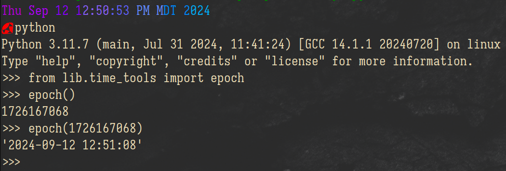

# Epoch  
_Easy Unix-time conversions_  

---  

# Usage:  
```python
>>> from lib.time_tools import epoch

>>> epoch()            # Get the current time in epoch
1726167929
>>> epoch(1726033987)  # Convert an arbitrary time from epoch
'2024-09-10 23:53:07'
>>> epoch(epoch())     # Get the current time in YYYY-MM-DD HH:MM:SS
'2024-09-12 13:05:29'
```  

__Example:__  
  
