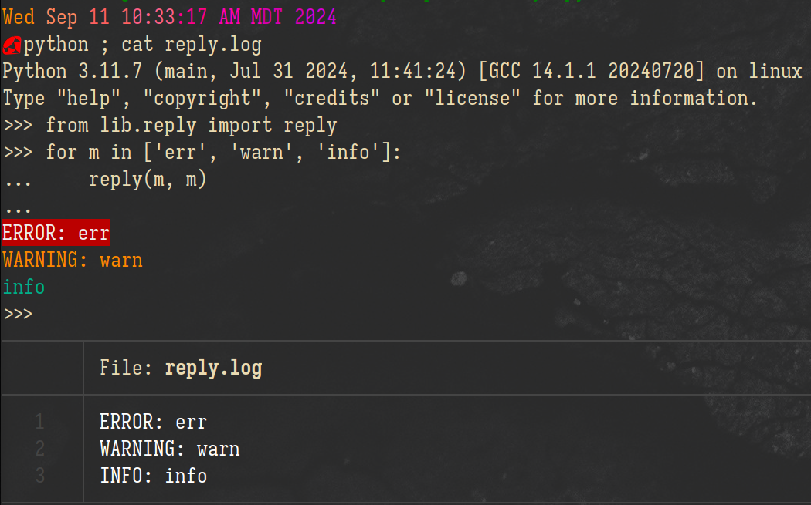

# Reply  
_Messages and logging with color based on severity_  

---  

# Usage:  
```python
from lib.reply import reply

reply('Some message', <log_level>, [log_file])
```  

> Note: `log_level` should be one of: ['error', 'err', 'e', 'warning', 'warn', 'w', 'information', 'info', 'i'],
`log_file` defaults to 'reply.log'.  

__Example:__  
  
